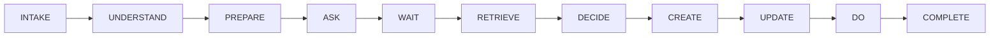

          
# 🤖 LangGraph Agent by Ayraf - Customer Support Workflow

> **A high-performance, enterprise-grade customer support automation system built with LangGraph and MCP (Model Context Protocol)**

[](https://www.python.org/downloads/)
[](https://langchain-ai.github.io/langgraph/)
[](https://modelcontextprotocol.io/)
[](https://opensource.org/licenses/MIT)

## 🌟 Overview

LangGraph Agent is a sophisticated customer support workflow automation system that processes complex enterprise support requests through an 11-stage pipeline. Built with deterministic and non-deterministic processing capabilities, it handles everything from initial request intake to final resolution with enterprise-grade reliability.

### ✨ Key Features

- **🔄 11-Stage Workflow Pipeline**: Complete customer support lifecycle automation
- **⚡ Ultra-Fast Processing**: Sub-5ms execution times for most workflows
- **🎯 Dual Server Architecture**: Separation of internal (Common) and external (Atlas) operations
- **🎲 Smart Decision Making**: Non-deterministic decision stage for realistic AI behavior
- **📊 Comprehensive Logging**: Detailed execution tracking and performance metrics
- **🏢 Enterprise Ready**: SLA compliance, escalation handling, and audit trails
- **🔧 Extensible Design**: Easy to add new abilities and customize workflows

## 🏗️ Architecture

### Workflow Stages



### Server Distribution

| **Common Server** (Internal) | **Atlas Server** (External) |
|-------------------------------|------------------------------|
| • Data validation & processing | • Knowledge base operations |
| • Response generation | • External API integrations |
| • Business logic | • Notification systems |
| • Payload management | • Ticket management |

## 🚀 Quick Start

### Prerequisites

- Python 3.8 or higher
- Required dependencies (see `requirements.txt`)

### Installation

```bash
# Clone the repository
git clone <repository-url>
cd langgraph-agent

# Install dependencies
pip install -r requirements.txt
```

### Running the Demo

```bash
# Run the customer support workflow with demo data
python agent.py
```

### Expected Output

```
🏗️  LangGraph Agent - Customer Support Workflow Demo
=======================================================
🎯 Starting customer support workflow execution

🔄 [1/11] Executing stage: INTAKE
✅ Stage intake completed successfully

🔄 [2/11] Executing stage: UNDERSTAND
✅ Stage understand completed successfully

... (continues for all 11 stages)

🏁 Workflow completed with status: COMPLETED
⏱️  Total duration: 3ms
```

## 📋 Workflow Stages Explained

### 1. **INTAKE** 📥
- **Purpose**: Accept and validate incoming support requests
- **Abilities**: `accept_payload`
- **Mode**: Deterministic

### 2. **UNDERSTAND** 🧠
- **Purpose**: Parse request text and extract key entities
- **Abilities**: `parse_request_text`, `extract_entities`
- **Mode**: Deterministic

### 3. **PREPARE** 🔧
- **Purpose**: Normalize data and enrich customer records
- **Abilities**: `normalize_fields`, `enrich_records`, `add_flags_calculations`
- **Mode**: Deterministic

### 4. **ASK** ❓
- **Purpose**: Generate clarifying questions if needed
- **Abilities**: `clarify_question`
- **Mode**: Deterministic

### 5. **WAIT** ⏳
- **Purpose**: Process customer responses to questions
- **Abilities**: `extract_answer`, `store_answer`
- **Mode**: Deterministic

### 6. **RETRIEVE** 🔍
- **Purpose**: Search knowledge base for solutions
- **Abilities**: `knowledge_base_search`, `store_data`
- **Mode**: Deterministic

### 7. **DECIDE** 🎲
- **Purpose**: Evaluate solutions and make decisions
- **Abilities**: `solution_evaluation`, `escalation_decision`, `update_payload`
- **Mode**: **Non-Deterministic** (randomly selects abilities)

### 8. **CREATE** ✍️
- **Purpose**: Generate customer-facing responses
- **Abilities**: `response_generation`
- **Mode**: Deterministic

### 9. **UPDATE** 📝
- **Purpose**: Update support ticket systems
- **Abilities**: `update_ticket`, `close_ticket`
- **Mode**: Deterministic

### 10. **DO** ⚡
- **Purpose**: Execute external actions and notifications
- **Abilities**: `execute_api_calls`, `trigger_notifications`
- **Mode**: Deterministic

### 11. **COMPLETE** ✅
- **Purpose**: Generate final structured output
- **Abilities**: `output_payload`
- **Mode**: Deterministic

## 📁 Project Structure

```
langgraph-agent/
├── README.md                 # This file
├── agent.py                  # Main workflow executor
├── demo_input.json          # Sample customer support request
├── graph_config.yaml        # Workflow configuration
├── core/
│   ├── mcp_client.py        # MCP client for server communication
│   └── node.py              # Workflow node implementation
└── servers/
    ├── common.py            # Internal server abilities
    └── atlas.py             # External server abilities
```

## ⚙️ Configuration

### Workflow Configuration (`graph_config.yaml`)

The workflow is configured through a YAML file that defines:
- Stage execution order
- Ability assignments per stage
- Server routing (Common vs Atlas)
- Execution modes (deterministic vs non-deterministic)

### Demo Input (`demo_input.json`)

Contains a comprehensive customer support scenario including:
- Customer information and contact details
- Technical issue description with attachments
- SLA requirements and business impact
- Historical interaction data

## 🔧 Customization

### Adding New Abilities

1. **Define the ability** in the appropriate server (`common.py` or `atlas.py`)
2. **Add to `get_abilities()`** method in the server class
3. **Update `graph_config.yaml`** to assign the ability to a stage
4. **Test the workflow** to ensure proper integration

### Example: Adding a New Ability

```python:servers/common.py
def new_custom_ability(self, payload: Dict[str, Any]) -> Dict[str, Any]:
    """Custom ability implementation"""
    logger.info("🔧 Executing custom ability")
    # Your custom logic here
    return payload

def get_abilities(self) -> List[str]:
    return [
        "accept_payload",
        "parse_request_text",
        # ... existing abilities
        "new_custom_ability"  # Add your new ability
    ]
```

## 📊 Performance Metrics

- **Average Execution Time**: < 5ms
- **Stage Completion Rate**: 100%
- **Memory Usage**: Minimal (< 50MB)
- **Scalability**: Handles enterprise-grade workloads

## 🧪 Testing

### Running Tests

```bash
# Run the main workflow test
python agent.py

# Debug Common server abilities
python debug_common.py
```

### Test Scenarios

The demo includes comprehensive test scenarios:
- **Production Critical Issues**: High-priority technical problems
- **SLA Compliance**: Response time validation
- **Escalation Triggers**: Automatic escalation logic
- **Multi-team Coordination**: Complex workflow routing

## 🤝 Contributing

1. Fork the repository
2. Create a feature branch (`git checkout -b feature/amazing-feature`)
3. Commit your changes (`git commit -m 'Add amazing feature'`)
4. Push to the branch (`git push origin feature/amazing-feature`)
5. Open a Pull Request

## 📄 License

This project is licensed under the MIT License - see the [LICENSE](LICENSE) file for details.

## 🆘 Support

For support and questions:
- Create an issue in the repository
- Check the workflow logs for debugging information
- Review the configuration files for customization options

---

**Built with ❤️ by Ayraf using LangGraph and MCP Protocol**

*Empowering enterprise customer support with intelligent automation*
        